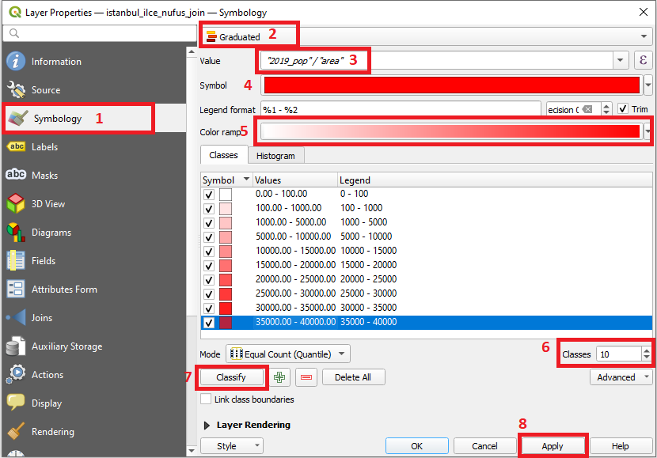
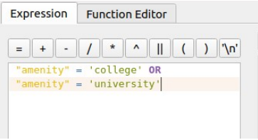
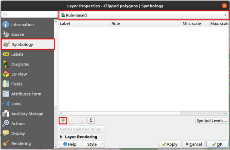
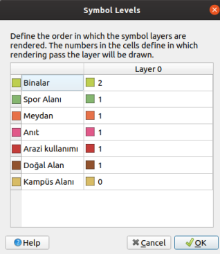
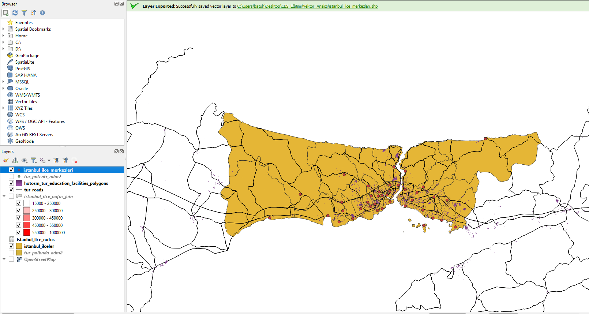

# 1. Vektör Veriler ile Çalışma 

Bu uygulamada açık veri platformlarından edinilen mekansal veri setleri ile vektör veriler üzerinde temel işlemlerin yapılması amaçlanmıştır.

## 1.1. Veri Seti

 

 

Veri seti olarak [Humanitarian Data Exchange](https://data.humdata.org/) web sayfasında paylaşılan:

- [Türkiye'deki Eğitim Tesisleri (Çokgen geometri tipinde)](https://data.humdata.org/dataset/hotosm_tur_education_facilities)

- [Türkiye'deki Yollar (Çizgi geometri tipinde)](https://data.humdata.org/dataset/roads-in-turkey)
- [Türkiye İdari Sınırlar ve Merkez Noktalar (Çokgen ve nokta geometri tipinde)](https://data.humdata.org/dataset/turkey-administrative-boundaries-levels-0-1-2)

veri setleri kullanılmıştır.

 
 

## 1.2. Vektör Verilerin Projeye Aktarılması

'Shapefile (.shp)' dosya formatında indirilen verilerin içeri aktarılması için, açılan projede, üst menüden;

> Katman -> Katman Ekle -> Vektör Katmanı Ekle

yolu izlenerek katman ekleme penceresine ulaşılır.

 

 

Açılan pencerede, eklenecek '.shp' uzantılı dosyanın konumu gösterilir. 'Ekle' butonuyla projeye eklenir.

 

 

Okullar, yollar ve ikinci seviye idari sınırlar katmanları projeye eklendikten sonra harita üzerindeki görünümleri şu şekildedir:

 

 
 

## 1.3. Projenin Koordinat Referans Sisteminin Ayarlanması

Çalışılacak koordinat sisteminin seçilmesi için;
> Proje -> Özellikler 

sekmesine tıklanır.

 

 

Açılan pencerede 'CRS' yani 'Koordinat Referans Sistemi' sekmesinden çalışılacak koordinat sistemi seçilir. Bu uygulamada 'TUREF (Türkiye Ulusal Referans Çerçevesi) – 2B Lambert Konform Konik
Projeksiyon Koordinat Sistemi' [EPSG:5637 - TUREF / LCC Europe](https://epsg.io/5637) kullanılmıştır. 

 

 

 
 

## 1.4. Katmanlarda Filtreleme ve Sorgu İşlemleri

Nesnelerin özniteliklerini gözlemleyebilmek için öznitelik tablosunu kullanırız. Bu tabloya ulaşmak için ilgili katmana sağ tıklanır, açılan menüde "Öznitelik Tablosu" butonu tıklanır. 

 

 

İdari sınırları içeren "tur_polbna_adm2" katmanın öznitelik tablosu açıldığında "İlçe, İl, Ülke" ismi gibi alanların olduğu görülebilir. 

 

 

Çalışmada "İstanbul'un ilçeleri" kullanılacaktır. Bu sebeple il alanı 'İSTANBUL' olan öznitelikler seçilmelidir. "İfadeye göre seçim" butonu ile sorgu penceresi açılır. 

 

 

Açılan pencerede il isimlerini içeren "adm1_tr" alanına göre ifade tanımlanmalıdır.

> "adm1_tr" = 'İSTANBUL' 

ifadesiyle ilçeler seçilir.

 

 

Seçilen varlıkların haritada sarı renk ile gösterildiği görülebilir.

 

 

Seçilen ilçeleri farklı bir katman olarak kaydetmek için "tur_polbna_adm2" katmanına sağ tıklanır, menüden;
> Dışa Aktar -> Seçili Öznitelikleri Kaydet

yolu ile ilgili pencereye ulaşılır. 

 

 

Açılan pencerede; dosya formatı, dosya ismi ve kaydedilecek konum, CRS gibi bilgiler seçilir. 'Tamam' butonu ile kaydetme tamamlanır ve projeye eklenir.

 

 

Diğer katmanların görünürlük tikleri kaldırıldığında, eklenen katmanın harita üzerindeki görünümü şekildeki gibidir. 

 

 

## 1.5. CSV Dosyalarının İçe Aktarılması

Türkiye İstatistik Kurumu (TÜİK) web sayfasından 2015 - 2019 yıllarına ait İstanbul ilçe nüfus verileri, "istanbul_ilce_nufus.csv" dosya adıyla kaydedilmiştir. Bu dosyayı içeri aktarmak için üst menüden:
> Katman -> Katman Ekle -> Ayrılmış Metin Katmanı Ekle

yolu izlenerek ilgili pencereye ulaşılır. 

 

 

".csv" dosya formatı, genellikle virgülle ayrılmış değerlerden oluşur ve yine genellikle ilk satırı sütun isimlerini içerir. Bu sebeple dosya formatı "CSV" seçilmelidir. Eklenecek dosya yalnızca ilçe isimleri ve nüfus bilgisinden oluştuğu için, geometri tanımlama menüsünde “geometri yok” seçeneği işaretlenir ve çalışmaya eklenir.

 

 
 

## 1.6. Tablo Birleştirme İşlemleri 

Eklenen nüfus verisi katmanı ile ilçeler katmanını birleştirmek için üst menüde yer alan veya 'CTRL+ALT+T' tuş kombinasyonu ile ulaşılabilen “Araçlar” menüsünden “alan değerlerine göre öznitelikleri birleştir” penceresine ulaşılır.

 

 

Birleştirme işlemi için, ulaşılan pencerede girdi katmanlar ve birleşme referansı olan tablo alanları seçilmelidir. Değerlerin eşleşebilmesi için tabloların aynı formatta (büyük harf, küçük harf, Türkçe karakter vb.) doldurulduğundan emin olunmalıdır. Sonuç katmanının kaydedileceği konum ve isim belirlenir, işlem başlatılır.

 

 

Aşağıdaki şekilde, işlem tamamlandıktan sonra nüfus bilgilerinin tabloya eklendiği görülebilir.

 

 

## 1.7. Alan Hesaplayıcı ile Tabloya Yeni Alan Ekleme

Nüfus yoğunluğu haritası oluşturmak için, ilçelerin alanlarının hesaplanması gerekmektedir. Bu sebeple katmanın öznitelik tablosu açılır. Araç çubuğunda bulunan 'abaküs' simgesi ile 'Alan Hesaplayıcı' aracına ulaşılır.

 

 

'Yeni alan oluştur' seçeneği işaretlenir, alan ismi ve veri tipi belirlenir. Hesaplamak için '$area' fonksiyonu kullanılır. Kilometre kare cinsinden hesap yapılmak istendiği için alan değeri '1.000.000' ile bölünür. İfade şu şekildedir.

> $area / 1000000

 

 

'area' alanının km² biriminde tabloya eklendiği görülebilir.

 

 

## 1.8. Katman Sembolojisi Ayarlama

Katman sembolojisi tablo alanlarına, değerlere bağlı olarak kurallara ve koşullara göre belirlenebilir. Bu çalışmada 2019 yılı nüfus verilerine ve ilçe alanlarına göre sınıflar oluşturulmuş ve uygun görülen renk paletiyle gösterim yapılmıştır. Katman özelliklerinden “semboloji” sekmesine ulaşılır, “derecelendirilmiş” seçeneği seçilir, sonrasında sınıflandırmanın yapılacağı ifade belirlenir, renk paleti seçilir. “Sınıflandır” butonuyla işlem tamamlanır. Oluşan sınıfların taban, tavan değerleri uygun şekilde normalize edilir.

 

 

Katman özelliklerini kullanarak varlıklar üzerinde etiket üretmek de mümkündür. Etiketler bölümünde, etiket üretilecek alan seçilir, ilgili düzenlemeler yapılır ve işlem gerçekleştirilir. Bu çalışmada ilçe isimlerine göre etiket üretilmiştir.

 

 

İşlemlerin sonucu şekilde gösterilmiştir.

 

 
 

## 1.9. Nüfus Verisine Göre Sorgular

Örnek olarak 2018 - 2019 yılları arasında nüfusu yüzde 5'in üzerinde artan ilçeler sorgulanmak istenmiştir. İfade şu şekildedir:

> (("2019_pop" - "2018_pop")/( "2018_pop" ) ) * 100 > 5

İfade ve sonuçları şekildeki gibidir. 5 ilçenin yüzde 5'in üzerinde nüfus artışı yaşadığı görülebilir.

 

 
 

## 1.10. Basılabilir Harita Oluşturma

QGIS ortamında yapılan çalışmayı basılabilir hale getirmek için “Proje” menüsünden “Yeni Baskı Düzeni Oluştur” sekmesi tıklanır.

 

 

Açılan pencerede “Öge Ekle” menüsünden “Harita Ekle” sekmesi açılır. Haritanın ekleneceği alan seçilerek harita eklenir.

 

 

“Öge özellikleri” kısmından çalışmaya uygun ölçek belirlenir. Solda bulunan araç çubuğunda bulunan araçlarla ilgili düzenlemeler yapılır.

 

 

Harita başlığı eklemek için aynı menüden “Etiket Ekle” seçeneği seçilir ve çokgen çizerek istenilen yere yerleştirilir. Öge özellikleri kısmından yazılacak metin ve başlığın konumu, görünüşü belirlenir.

 

 

Aynı şekilde kuzey oku, lejant ve ölçek ögeleri de haritaya yerleştirilir. Öge özelliklerinden istenilen görünüme ulaşmak adına düzenlemeler yapılabilir. Oluşan ürün aşağıdaki gibidir.

 

 
 

İstenilen formatta (PDF, PNG v.b.) kaydedilerek dışa aktarma işlemi yapılabilir.

 
 

## 1.11. OpenStreetMap Altlığı Üzerinde Sayısallaştırma İşlemleri

Sayısallaştırma, coğrafi bilgi sistemi uygulamalarında raster verinin vektör veriye
dönüştürülmesi için yaygın kullanılan bir yöntemdir. Bu bölümde QGIS yazılımı
kullanılarak OSM altlık haritası üzerinde nokta, çizgi, çokgen vektör veri tiplerinde veri üretimi yapılmıştır.

İlk olarak QGIS ile birlikte gelen OpenStreetMap altlığı projeye eklenir. 

> Browser -> XYX Tiles -> OpenStreetMap

yolu izlenerek ulaşılabilir.

 

 

Ardından, ilk katmanımız olan çokgen (polygon) katmanını oluşturmak için üst menüden 

>*"Katman -> Katman Oluştur -> Yeni ShapeFile Katmanı"* 

yolu ile katman oluşturma penceresine ulaşılır. 

 

 

Açılan pencerede; dosyanın kaydedileceği konum ve dosya ismi, geometri tipi, çalışılacak koordinat sistemi belirlenir, tablonun alanları eklenir  ve *Tamam* tuşu ile işlem tamamlanır. Oluşturulan katman, katmanlar menüsünde görülebilir.

 

 

Oluşturulan katman seçili durumdayken araç çubuğunda bulunan düzenleme
araçlarından düzenleme aktifleştirilir ve poligon detayı ekle tuşuyla sayısallaştırma
işlemine başlanır.

 

 

Sayısallaştırmak üzere seçilen nesne üzerinde çizilen poligon, farenin sağ tuşu ile
tamamlanır ve daha önce katman özelliklerinde belirlenen alanlara göre bilgiler
girilerek öznitelik kaydedilir.

 

 

 

 

Aynı işlemler nokta ve çizgi katmanları oluşturularak tekrarlanır. Çizimler tamamlandığında verilerin kanava üzerindeki durumu aşağıdaki gibidir.

 

 
 
 

## 1.12. OpenStreetMap Verileri İle Çalışma

OpenStreetMap verilerini indirebilmek için çeşitli yollar vardır. Bu çalışmada
OpenStreetMap web sitesi üzerinden dışa aktarma işlemi yapılmıştır. Diğer
yöntemler hakkında bilgi almak için OpenStreetMap web sitesi ziyaret edilebilir.
İlk olarak OpenStreetMap web sayfasına girilir ve üst kısımda yer alan “Export”
butonu ile dışa aktarma sayfasına ulaşılır. İhtiyaç duyulan alanı seçmek için şekilde gösterilen “El ile farklı bir alan seç” seçeneğiyle harita üzerinde istenilen
alan çokgen içine alınır. Dışa aktar seçeneği ile bilgisayara kaydedilir.

 

 

 

Daha sonra QGIS ortamında “Vektör Katmanı Ekle” seçeneği ile indirilen veri seti
açılır. Çizgi, çoklu çizgi, çokgen, nokta ve ilişkiler katmanlarının eklendiği
görülebilir.

 Eklenen katmanlar:

 

 

Katmanların kanava üzerinde görünümü:

 

 

Öznitelik tablosu incelendiğinde görülebileceği üzere öznitelikler OSM
veritabanında etiketler halinde saklanır. Turizm tesisi, spor alanı, bina, tesis gibi alt
başlıklar sınıflandırma yapılarak farklı katmanlara ayrılabilir. Bu çalışmada İTÜ
Ayazağa Kampüsü sınırları içerisinde bulunan varlıklar kullanılacaktır. Bu nedenle
kampüs sınırlarını belirten öznitelik bulunarak ayrı bir katman olarak kaydedilmeli
ve diğer katmanlar bu referans katmana göre kırpılmalıdır. İlk olarak çokgen
katmanının öznitelik tablosundan sorgu penceresi açılır.

Sorgu ekranında “Alanlar ve Değerler” başlığından “amenity (tesis)” alanına çift
tıklanır. “All unique” seçeneğine tıklayarak alanın alabileceği değerler görülebilir.

 

 

 Bir üniversite kampüsünün karşılığı olabilecek değerler şekilde
görüldüğü üzere “college” veya “university” olabilir. Bu sebeple “veya” bağlacı
içeren iki farklı ifade ile seçim yapılmalıdır. 

 

 

İfadeye göre seçim işlemi yapıldıktan sonra, öznitelik tablosunda “seçimleri en üste
taşı” seçeneği tıklanır ve seçimlerin en üstte olduğu görülebilir.

 

 

Seçilen öznitelik farklı bir katman olarak kaydedilir ve çalışmaya eklenir.

 

 

Eğer veri setinde geçersiz geometriler bulunuyorsa, bu hatalar el ile yahut
“Geometrileri düzelt (fix geometries)” aracı ile düzeltilmelidir ve düzeltilmiş
geometriler yeni katman olarak eklenmelidir. Bu araca ulaşmak için “Ctrl+Alt+T”
kısayolu ile ulaşılan araç kutusundan “Vektör geometrisi” menüsündeki
“Geometrileri düzelt” aracı seçilir.

 

 

Ulaşılan pencerede girdi katman ve çıktı katmanın konumu belirlenerek düzeltme
işlemi tamamlanır ve çalışmaya eklenir.

 

 

Referans katmana göre kırpma işlemi için araç kutusundan “Vector overlay” menüsü
altında bulunan “Clip (kırp)” aracı seçilir.

 

 

Açılan pencerede kırpılacak katman girdi olarak, kırpmaya referans olan katman
örten katman olarak seçilir. Çıktı katmanın ismi ve kaydedilecek konumu belirlenir.
İşlem gerçekleştirilir ve çıktı katman çalışmaya aktarılır.

 

 

Bu işlem çokgen, çizgi ve nokta katmanları için uygulandıktan sonra “Katmanlar”
bölümünden kırpılmış katmanlar dışında kalan katmanların görünürlük tiki kaldırılır.
Oluşan sonuç şekilde gösterilmiştir.

 

 

Çokgen katmanında bulunan özniteliklerin sınıflandırılması için kırpılmış olan
poligon katmanında “katman özellikleri” açılır. Semboloji sekmesinde “Kural bazlı”
semboloji seçilir. “Kural ekle” butonuna tıklanır.

 

 

OpenStreetMap verileri etiketlerle saklandığı için tablo alanlarına göre sınıflandırma
yapmak gerekir. Örneğin, binaları sınıflandırmak için “building” alanında bulunan
değerler belirleyicidir. Bu nedenle “building” alanı boş olmayan varlıkları seçmek
gerekmektedir. Bunun için “eşit değil” anlamına gelen “<>” operatörü
kullanılır. Yapılan seçim işlemi ve sınıflandırma sonucu
aşağıdaki şekillerde görülebilir.

 

 

 

 

Olası kural örnekleri şekilde gösterilmiştir.

 

 

Büyük alanlı varlıklar, çizim sırasından dolayı diğer
varlıkları kapatabilir. Çalışmada kullanılan varlıklar en üstte gözükecek varlıktan en
altta gözükecek varlığa doğru çizim sırasına sokulmalıdır. Bunun için “Kural bazlı
semboloji” penceresinden “sembol seviyesi” penceresi açılır. 

 

 

Açılan
pencerede en üstte gözükmesi istenen semboller en yüksek seviyede olacak şekilde düzenleme yapılır.

 

 

Çizim sıraları düzenlendikten sonra çalışmanın görüntüsü şekilde
gösterilmiştir.

 

 

Kural bazlı semboloji penceresinde bir kurala sağ tıklayarak “Mevcut kuralı düzenle”
sekmesinden “Kurala kategori ekle” seçeneği seçilir.

 

 

Örneğin doğal alanlar için “natural” alanına göre sınıflandırma işlemi yapılır ve yeni
oluşturulan sınıfların sembol seviyeleri düzenlenir.

 

 

Yapılan örnek sınıflandırmalar şu şekildedir:

 

 

Harita üzerinde görünüm:

 

 
 
 
 

## 1.13. Vektör Analiz Araçları

Daha önce projeye eklenen ve görünürlük tiki kaldırılmış ilçe merkezleri ('tur_pntcntr_adm2') katmanı tekrar görünür hale getirilir. İstanbul ilçe idari sınırları için yapılan seçim ve farklı kaydetme işlemi bu katman için de uygulanır. Kaydederken **hedef CRS**, projede kullanılan sistem olan **"TUREF /LCC Europe (EPSG:5637)"** olmalıdır. 

 

 

Daha sonra "CTRL + ALT + T" tuş kombinasyonuyla ya da araç çubuğunda bulunan **"Dişli"** simgesiyle araç kutusuna ulaşılır. Burada arama çubuğuna "Buffer vectors" yazılarak GDAL kütüphanesinin tampon oluşturma aracı bulunur ve çift tıklayarak araç açılır. İstanbul ilçe merkezleri katmanı, girdi katman olarak seçilir. Oluşturulacak tamponun noktadan uzaklığı 1000 metre olarak girilir. Dosya kaydedilecekse, konumu ve ismi girilir. Geçici dosya olarak da tutulabilir.

 

 

Sonuç şekildeki gibidir. 

 

 

Bu katman, ilçe merkezlerine '1 km' uzaklıkta bulunan okulların seçilmesi için kullanılacaktır. Yine araç kutusundan, "Vector Selection" başlığı altındaki "Extract by Location" aracı seçilerek buffer katmanı ile kesişen okullar ayıklanacaktır.

 

 

Varlıkların ayıklanacağı katman, okulların bulunduğu katman olmalıdır. Karşılaştırma yapılacak katman ise oluşturulan 'buffer' katmanı olarak seçilir. İşlem gerçekleştirilir.

 

 

Şekilde görüleceği üzere, tamponlar ile kesişen okullar yeni oluşan katmana eklenerek yeşil renkle gösterilmiştir.

 

 

Bir başka vektör analiz aracı olarak, ağ analiz aracı olan 'En kısa yol' algoritması kullanılabilir. Araç kutusundan "Shortest path (point to point)" aracı seçilir.

 

 

Yollar katmanı girdi katman olarak seçilir. Başlangıç ve bitiş noktaları, kutucukların yanında bulunan '...' üç nokta butonu ile harita üzerinde işaretlenir. Hesaplama işlemi başlatılır.

 

 

Örnek olarak, Ankara - Gebze arasındaki en kısa yol hesaplanmıştır.

 

 

