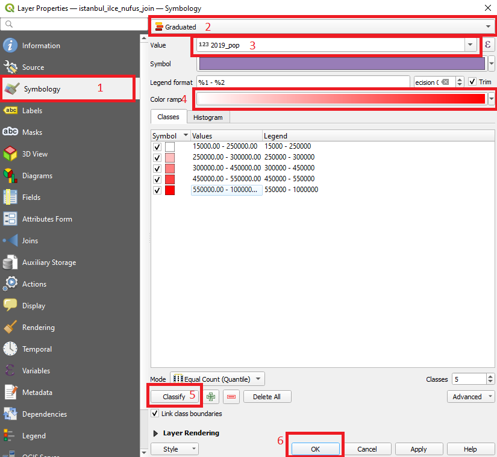
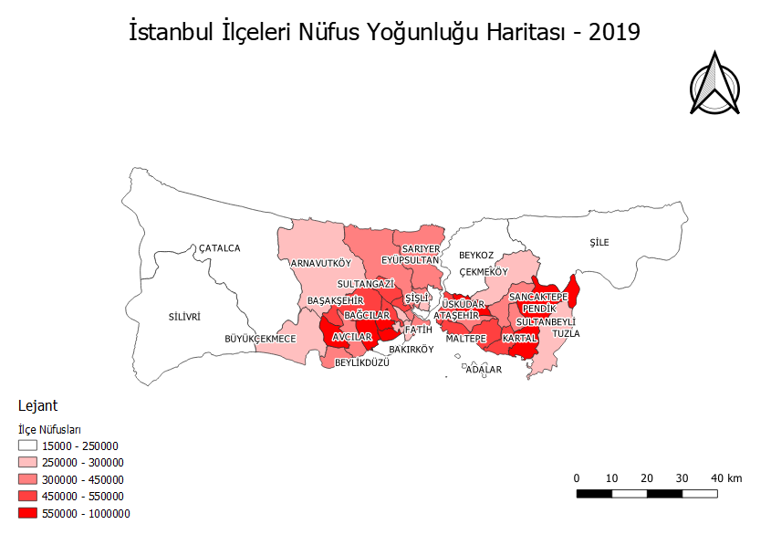

# Vektör Veriler ile Çalışma 

Bu uygulamada açık veri platformlarından edinilen mekansal veri setleri ile vektör veriler üzerinde temel işlemlerin yapılması amaçlanmıştır.

## Veri Seti

Veri seti olarak [Humanitarian Data Exchange](https://data.humdata.org/) web sayfasında paylaşılan:

- [Türkiye'deki Eğitim Tesisleri (Çokgen geometri tipinde)](https://data.humdata.org/dataset/hotosm_tur_education_facilities)

- [Türkiye'deki Yollar (Çizgi geometri tipinde)](https://data.humdata.org/dataset/roads-in-turkey)
- [Türkiye İdari Sınırlar ve Merkez Noktalar (Çokgen ve nokta geometri tipinde)](https://data.humdata.org/dataset/turkey-administrative-boundaries-levels-0-1-2)

veri setleri kullanılmıştır.

 
 

## Vektör Verilerin Projeye Aktarılması

'Shapefile (.shp)' dosya formatında indirilen verilerin içeri aktarılması için, açılan projede, üst menüden;

> Katman -> Katman Ekle -> Vektör Katmanı Ekle

yolu izlenerek katman ekleme penceresine ulaşılır.

 

 

Açılan pencerede, eklenecek '.shp' uzantılı dosyanın konumu gösterilir. 'Ekle' butonuyla projeye eklenir.

 

 

Okullar, yollar ve ikinci seviye idari sınırlar katmanları projeye eklendikten sonra harita üzerindeki görünümleri şu şekildedir:

 

 
 

## Projenin Koordinat Referans Sisteminin Ayarlanması

Çalışılacak koordinat sisteminin seçilmesi için;
> Proje -> Özellikler 

sekmesine tıklanır.

 

 

Açılan pencerede 'CRS' yani 'Koordinat Referans Sistemi' sekmesinden çalışılacak koordinat sistemi seçilir. Bu uygulamada 'TUREF (Türkiye Ulusal Referans Çerçevesi) – 2B Lambert Konform Konik
Projeksiyon Koordinat Sistemi' [EPSG:5637 - TUREF / LCC Europe](https://epsg.io/5637) kullanılmıştır. 

 

 

 
 

## Katmanlarda Filtreleme ve Sorgu İşlemleri

Nesnelerin özniteliklerini gözlemleyebilmek için öznitelik tablosunu kullanırız. Bu tabloya ulaşmak için ilgili katmana sağ tıklanır, açılan menüde "Öznitelik Tablosu" butonu tıklanır. 

 

 

İdari sınırları içeren "tur_polbna_adm2" katmanın öznitelik tablosu açıldığında "İlçe, İl, Ülke" ismi gibi alanların olduğu görülebilir. 

 

 

Çalışmada "İstanbul'un ilçeleri" kullanılacaktır. Bu sebeple il alanı 'İSTANBUL' olan öznitelikler seçilmelidir. "İfadeye göre seçim" butonu ile sorgu penceresi açılır. 

 

 

Açılan pencerede il isimlerini içeren "adm1_tr" alanına göre ifade tanımlanmalıdır.

> "adm1_tr" = 'İSTANBUL' 

ifadesiyle ilçeler seçilir.

 

 

Seçilen varlıkların haritada sarı renk ile gösterildiği görülebilir.

 

 

Seçilen ilçeleri farklı bir katman olarak kaydetmek için "tur_polbna_adm2" katmanına sağ tıklanır, menüden;
> Dışa Aktar -> Seçili Öznitelikleri Kaydet

yolu ile ilgili pencereye ulaşılır. 

 

 

Açılan pencerede; dosya formatı, dosya ismi ve kaydedilecek konum, CRS gibi bilgiler seçilir. 'Tamam' butonu ile kaydetme tamamlanır ve projeye eklenir.

 

 

Diğer katmanların görünürlük tikleri kaldırıldığında, eklenen katmanın harita üzerindeki görünümü şekildeki gibidir. 

 

 

## CSV Dosyalarının İçe Aktarılması

Türkiye İstatistik Kurumu (TÜİK) web sayfasından 2015 - 2019 yıllarına ait İstanbul ilçe nüfus verileri, "istanbul_ilce_nufus.csv" dosya adıyla kaydedilmiştir. Bu dosyayı içeri aktarmak için üst menüden:
> Katman -> Katman Ekle -> Ayrılmış Metin Katmanı Ekle

yolu izlenerek ilgili pencereye ulaşılır. 

 

 

".csv" dosya formatı, genellikle virgülle ayrılmış değerlerden oluşur ve yine genellikle ilk satırı sütun isimlerini içerir. Bu sebeple dosya formatı "CSV" seçilmelidir. Eklenecek dosya yalnızca ilçe isimleri ve nüfus bilgisinden oluştuğu için, geometri tanımlama menüsünde “geometri yok” seçeneği işaretlenir ve çalışmaya eklenir.

 

 
 

## Tablo Birleştirme İşlemleri 

Eklenen nüfus verisi katmanı ile ilçeler katmanını birleştirmek için üst menüde yer alan veya 'CTRL+ALT+T' tuş kombinasyonu ile ulaşılabilen “Araçlar” menüsünden “alan değerlerine göre öznitelikleri birleştir” penceresine ulaşılır.

 

 

Birleştirme işlemi için, ulaşılan pencerede girdi katmanlar ve birleşme referansı olan tablo alanları seçilmelidir. Değerlerin eşleşebilmesi için tabloların aynı formatta (büyük harf, küçük harf, Türkçe karakter vb.) doldurulduğundan emin olunmalıdır. Sonuç katmanının kaydedileceği konum ve isim belirlenir, işlem başlatılır.

 

 

Aşağıdaki şekilde, işlem tamamlandıktan sonra nüfus bilgilerinin tabloya eklendiği görülebilir.

 

 

## Katman Sembolojisi Ayarlama

Katman sembolojisi tablo alanlarına, değerlere bağlı olarak kurallara ve koşullara göre belirlenebilir. Bu çalışmada 2019 yılı nüfus verilerine göre sınıflar oluşturulmuş ve uygun görülen renk paletiyle gösterim yapılmıştır. Katman özelliklerinden “semboloji” sekmesine ulaşılır, “derecelendirilmiş” seçeneği seçilir, sonrasında sınıflandırmanın yapılacağı tablo alanı, renk paleti seçilir. “Sınıflandır” butonuyla işlem tamamlanır. Oluşan sınıfların taban, tavan değerleri uygun şekilde normalize edilir.

 

 

Katman özelliklerini kullanarak varlıklar üzerinde etiket üretmek de mümkündür. Etiketler bölümünde, etiket üretilecek alan seçilir, ilgili düzenlemeler yapılır ve işlem gerçekleştirilir. Bu çalışmada ilçe isimlerine göre etiket üretilmiştir.

 

 

İşlemlerin sonucu şekilde gösterilmiştir.

 

 
 

## Nüfus Verisine Göre Sorgular

Örnek olarak 2018 - 2019 yılları arasında nüfusu yüzde 5'in üzerinde artan ilçeler sorgulanmak istenmiştir. İfade şu şekildedir:

> (("2019_pop" - "2018_pop")/( "2018_pop" ) ) * 100 > 5

İfade ve sonuçları şekildeki gibidir. 5 ilçenin yüzde 5'in üzerinde nüfus artışı yaşadığı görülebilir.

 

 
 

## Basılabilir Harita Oluşturma

QGIS ortamında yapılan çalışmayı basılabilir hale getirmek için “Proje” menüsünden “Yeni Baskı Düzeni Oluştur” sekmesi tıklanır.

 

 

Açılan pencerede “Öge Ekle” menüsünden “Harita Ekle” sekmesi açılır. Haritanın ekleneceği alan seçilerek harita eklenir.

 

 

“Öge özellikleri” kısmından çalışmaya uygun ölçek belirlenir. Solda bulunan araç çubuğunda bulunan araçlarla ilgili düzenlemeler yapılır.

 

 

Harita başlığı eklemek için aynı menüden “Etiket Ekle” seçeneği seçilir ve çokgen çizerek istenilen yere yerleştirilir. Öge özellikleri kısmından yazılacak metin ve başlığın konumu, görünüşü belirlenir.

 

 

Aynı şekilde kuzey oku, lejant ve ölçek ögeleri de haritaya yerleştirilir. Öge özelliklerinden istenilen görünüme ulaşmak adına düzenlemeler yapılabilir. Oluşan ürün aşağıdaki gibidir.

 

 
 

İstenilen formatta (PDF, PNG v.b.) kaydedilerek dışa aktarma işlemi yapılabilir.

 
 

## Vektör Analiz Araçları

Daha önce projeye eklenen ve görünürlük tiki kaldırılmış ilçe merkezleri ('tur_pntcntr_adm2') katmanı tekrar görünür hale getirilir. İstanbul ilçe idari sınırları için yapılan seçim ve farklı kaydetme işlemi bu katman için de uygulanır. Kaydederken **hedef CRS**, projede kullanılan sistem olan **"TUREF /LCC Europe (EPSG:5637)"** olmalıdır. 

 

 

Daha sonra "CTRL + ALT + T" tuş kombinasyonuyla ya da araç çubuğunda bulunan **"Dişli"** simgesiyle araç kutusuna ulaşılır. Burada arama çubuğuna "Buffer vectors" yazılarak GDAL kütüphanesinin tampon oluşturma aracı bulunur ve çift tıklayarak araç açılır. İstanbul ilçe merkezleri katmanı, girdi katman olarak seçilir. Oluşturulacak tamponun noktadan uzaklığı 1000 metre olarak girilir. Dosya kaydedilecekse, konumu ve ismi girilir. Geçici dosya olarak da tutulabilir.

 

 

Sonuç şekildeki gibidir. 

 

 

Bu katman, ilçe merkezlerine '1 km' uzaklıkta bulunan okulların seçilmesi için kullanılacaktır. Yine araç kutusundan, "Vector Selection" başlığı altındaki "Extract by Location" aracı seçilerek buffer katmanı ile kesişen okullar ayıklanacaktır.

 

 

Varlıkların ayıklanacağı katman, okulların bulunduğu katman olmalıdır. Karşılaştırma yapılacak katman ise oluşturulan 'buffer' katmanı olarak seçilir. İşlem gerçekleştirilir.

 

 

Şekilde görüleceği üzere, tamponlar ile kesişen okullar yeni oluşan katmana eklenerek yeşil renkle gösterilmiştir.

 

 

Bir başka vektör analiz aracı olarak, ağ analiz aracı olan 'En kısa yol' algoritması kullanılabilir. Araç kutusundan "Shortest path (point to point)" aracı seçilir.

 

 

Yollar katmanı girdi katman olarak seçilir. Başlangıç ve bitiş noktaları, kutucukların yanında bulunan '...' üç nokta butonu ile harita üzerinde işaretlenir. Hesaplama işlemi başlatılır.

 

 

Örnek olarak, Ankara - Gebze arasındaki en kısa yol hesaplanmıştır.

 

 

