# Raster Veriler ile Çalışma

Bu çalışmada ABD Jeoloji Araştırmaları Kurumu (USGS) web sayfasında
yayımlanan sayısal yükseklik modeli verileri kullanılacaktır. USGS EarthExplorer
portalında birçok hava fotoğrafı, uydu görüntüsü, sayısal yükseklik modeli gibi
veriler açık olarak paylaşılmaktadır. 

 

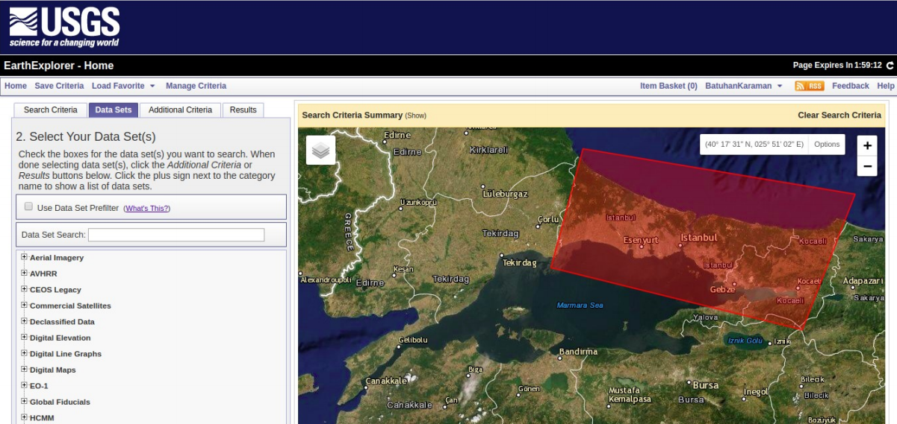

 

Aramanın yapılacağı alan, veri seti gibi ölçütler seçildikten sonra sonuç sayfasından
gereksinimlere uygun veriler “GeoTIFF” formatında indirilir. GeoTIFF, coğrafi
referans bilgilerini de içeren bir resim formatıdır. İndirilen veriler QGIS projesine
eklenir. Veriler klasöründe bu uygulamada kullanılan dosyalar bulunabilir.

 

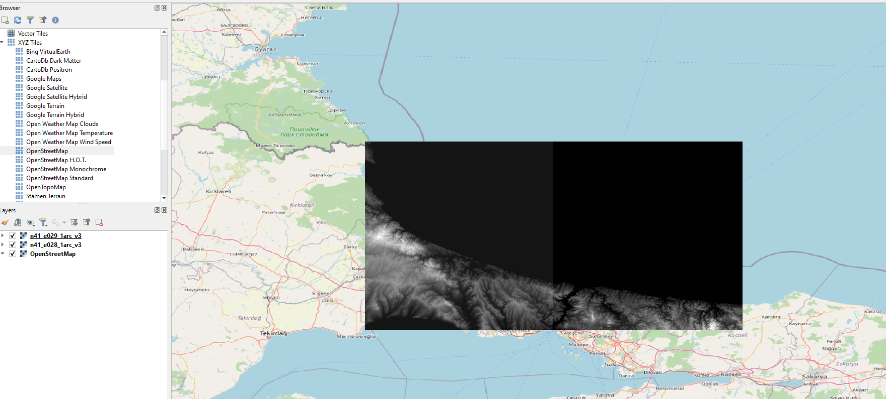

 

## Temel Raster AraçlarıRaster veri analizi için farklı araçlar da vardır, bunlardan biri rölyef temsil yöntemi
olan “tepe gölgelemesi” aracıdır. “Raster” menüsünde bulunan “Analiz”
sekmesinden “Hillshade” aracı açılır. Girdi katman, ışığın geliş açısı gibi değişkenler
belirlenerek işlem çalıştırılır ve çıktı katman projeye eklenir. Katman özelliklerinden
katmanın opaklığı düşürülür. Böylece oluşturulan iki katman birlikte kullanılarak
daha iyi bir görüntü elde edilmiş olunur.

Katmanları birleştirmek için araç kutusundan “GDAL” sekmesindeki “Birleştir”
aracı açılır ve girdi katmanlar işleme sokulur. Birleştirilmiş katman
projeye eklenir.

 

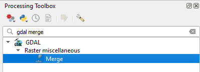

 

 

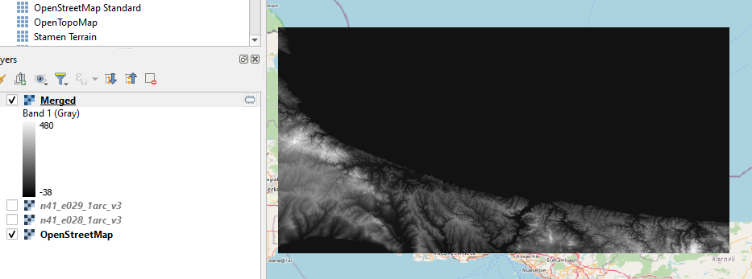

 

Katman özellikleri penceresinden ulaşılan semboloji sekmesinde farklı çizdirme
şekilleri kullanılarak değişiklikler yapılabilir ve yükseklik verisi görsel olarak
somutlaştırılır. Örnek işlem olarak “tek bant psödö-renk” çizdirme tipi ile
sınıflandırma yapılmıştır. İşlemin sonucu aşağıdaki gibidir.

 

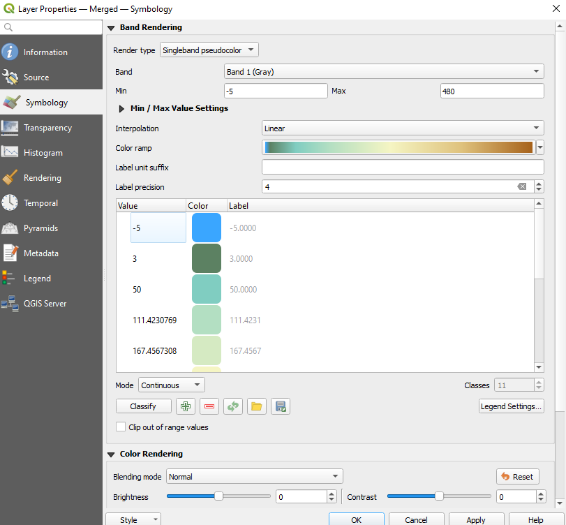

 

 

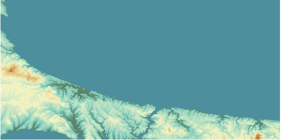

 

Raster veri analizi için farklı araçlar da vardır, bunlardan biri rölyef temsil yöntemi
olan “tepe gölgelemesi” aracıdır. “Raster” menüsünde bulunan “Analiz”
sekmesinden “Hillshade” aracı açılır. Girdi katman, ışığın geliş açısı gibi değişkenler
belirlenerek işlem çalıştırılır ve çıktı katman projeye eklenir. Katman özelliklerinden
katmanın opaklığı düşürülür. Böylece oluşturulan iki katman birlikte kullanılarak
daha iyi bir görüntü elde edilmiş olunur.

 

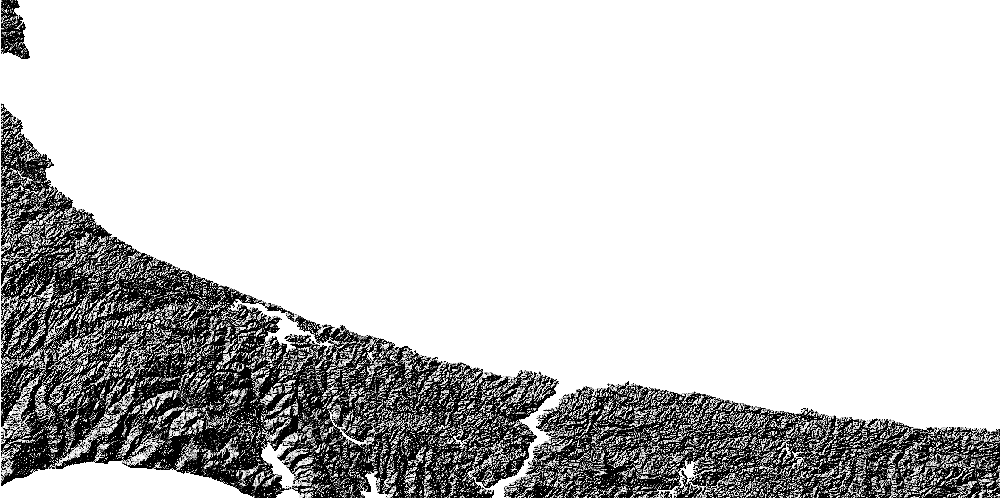

 

Opaklık düşürüldüğünde, iki katmanın görüntüsü:

 

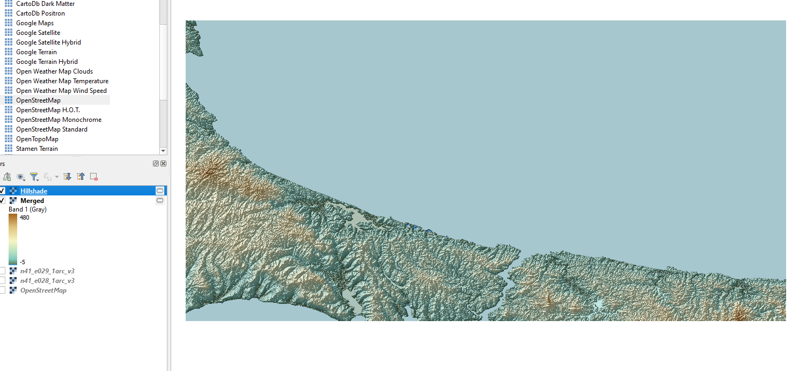

 

Bir başka araç ise bakı hesaplama aracıdır. Yine “Raster” menüsünün “Analiz”
sekmesinden “Bakı (Aspect)” aracına ulaşılır ve girdi katman işleme sokulur. Örnek işlem
sonucu şekilde gösterilmiştir.

 

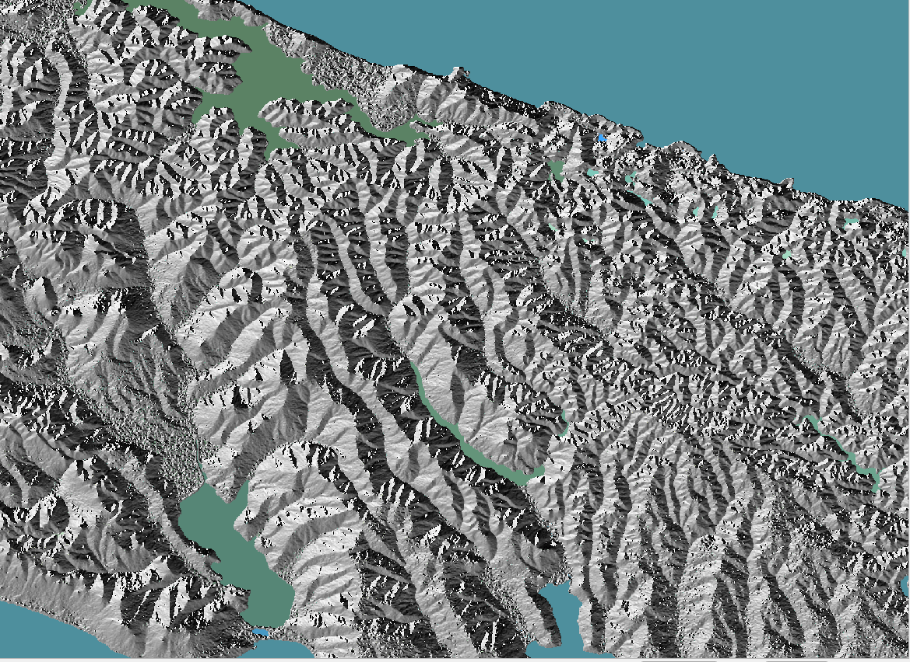

 

Bu çalışmada da güneye bakan yamaçların bulunması amaçlanmıştır.
İlk olarak “Raster” menüsünden “Raster Hesaplayıcı” açılır.

 

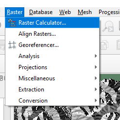

 

Kuzey yönü 0, güney ise 180 derecedir. Güneye bakan kısımları seçmek için aşağıdaki ifade yazılır ve sonuç katmanı
kaydedilir. 
> "Aspect@1" <= 270 and "Aspect@1" >= 90

Sonuç katmanı şekilde gösterilmiştir. Sonuç katmanında beyaz olan
kısımlar güneye, siyah olan kısımlar kuzeye bakmaktadır.

 

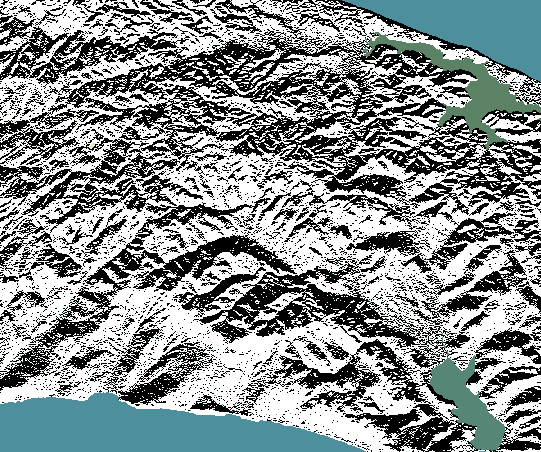

 

Son olarak, QGIS'in 3B Harita aracı ile projedeki yükseklik modeli kullanılarak basit bir 3B görüntü elde edilecektir. 'Görünüm' menüsünden 'Yeni 3B Harita Görüntüsü' seçeneği seçilir.

 

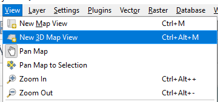

 

Açılan pencerede, 'İngiliz Anahtarı' ikonuna tıklayarak açılan menüde 'Ayarla' penceresine gidilir. 

 

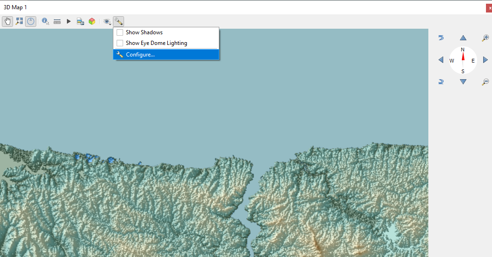

 

Kullanılan DEM katmanı yükseklik için tanımlanır. Düşer ölçek ve çözünürlük ayarlanır. 

 

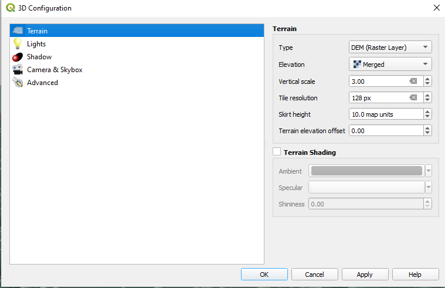

 

Farenin tekerleğine basılı tutularak bakış açısı değiştirilebilir. Sonuç aşağıdaki gibidir.

 

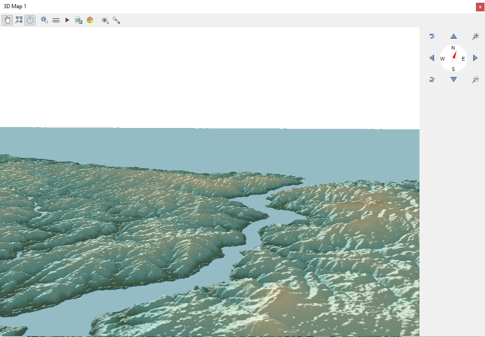

 