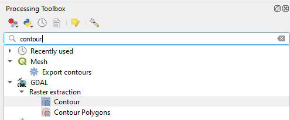

# 3. Bitirme Projesi

## 3.1. Giriş

Eğitim boyunca öğrenilen temel raster ve vektör araçlarının birçoğunun bir arada kullanılmasının amaçlandığı bir proje olması tasarlanmıştır. 

 

OpenStreetMap ve USGS ortamlarından edinilen Büyükada'ya ait vektör ve raster veri setleri kullanılmıştır. Verilere [bu bağlantıdan](https://github.com/batuwan/qgis_egitimi/tree/main/3_OSM/Veriler) ulaşmak mümkündür.

## 3.2. Veri Setinin Projeye Eklenmesi

Görselde görülebilecek vektör ve raster katmanları projeye eklenir.

- Tesisler
- Yollar
- Arazi kullanımı
- Turizm
- Büyükada Sınırları 
- Sayısal yükseklik modeli 

katmanları eklenmiştir.

 

 
 

## 3.3. Yükseklik Modelinin Referans Katmana Göre Kırpılması

Kullanılan yükseklik modeli, çalışma yapılacak alana göre daha büyük bir alanı kapsamaktadır. Bu sebeple sınırlar katmanına göre bir kırpma işlemi yapılmalıdır.

Araç kutusundan 'GDAL Raster kırpma aracı'na ulaşılır. 

 

 

Girdi katman olarak "raster veri katmanı", maske katman olarak ise "Büyükada sınırları" katmanı seçilir. Katmanların tam isimleri görselde görülebilir.

 

 

İşlem çalıştırıldığında sonuç aşağıdaki gibi olacaktır.

 

 
 

## 3.4. Eşyükselti Eğrisi Oluşturma

DEM verilerinden eşyükselti eğrileri oluşturmak da mümkündür. Yine araç çubuğundan 'GDAL kontur (contour) aracı'na ulaşılır. 

 

 

Girdi katman olarak, ada sınırlarına göre kırpılmış olan yükseklik modeli seçilmelidir. Eğri oluşturma aralığı gibi parametreler belirlenir ve işlem çalıştırılır.

 

 

Oluşturulan katmanın kanava üzerinde görünümü şekildeki gibidir.

 

 
 

## 3.5. OSM Verilerinin Sınıflandırılması

Vektörler eğitimi için olan dokümanda OSM verileri ile çalışma, sınıflandırma üzerine yapılan çalışmalar bu kısımda kullanılacaktır.

Örnek sınıflandırmalar şekillerle gösterilmiştir:

1- Tesisler (amenity) Katmanı

 

 

2- Yollar (highway) Katmanı

 

 

3- Turizm (tourism) Katmanı

 

 

4- Arazi Kullanımı (landuse) Katmanı

 

 
 

## 3.6. Tepe Gölgelendirmesi Katmanının Eklenmesi

Raster veriler ile yapılan çalışmada 'Tepe gölgelendirmesi (Hillshade)' oluşturma işlemleri gerçeklenmişti. Bu çalışmada, ada sınırlarına göre kırpılan DEM katmanından 'hillshade' oluşturulmuştur.

Uygun görülen azimut açısı ve ölçek değerleri girilerek 'hillshade' oluşturulur ve çalışmaya eklenir. 

Sınıflandırmalar ve raster işlemleri sonunda, katmanların görünümü şu şekildedir:

 

 

## 3.7. Basılabilir Harita Oluşturma - Grid Ekleme

Daha önce gerçekleştirilen basılabilir harita oluşturma aşamalarına ek olarak, grid ağı ekleme işlemi gerçekleştirilecektir. 

Eklenen haritanın özellikler menüsünden 'Grid' sekmesine ulaşılır ve yeni bir grid eklenir.

 

 

Grid'i düzenle butonu ile grid aralığı, stili, projeksiyon gibi ayarlar görünüş sekmesinden yapılır. 

 

 

Hemen altında bulunan çerçeve sekmesinden ise kullanılacak çerçevenin ayarlamaları yapılır.

 

 

Çerçeve ve grid oluşmasına rağmen koordinat henüz gözükmemektedir. Bunun için ise 'Koordinatları Çiz' seçeneği seçilir ve düzenle ilgili ayarlamalar yapılır.

 

 

Eklenen grid ağının görünüşü şekildeki gibidir.

 

 

Diğer harita elemanları da eklenerek basılabilir harita oluşturma işlemi tamamlanmış olur.

 

 